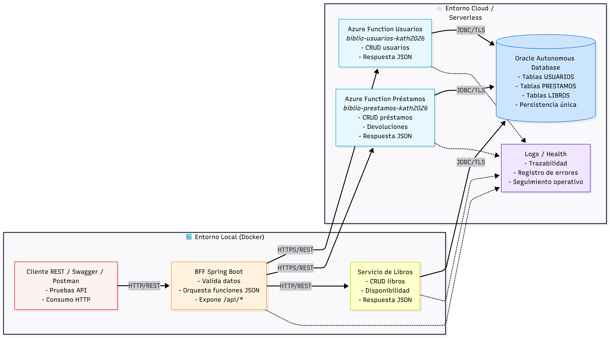
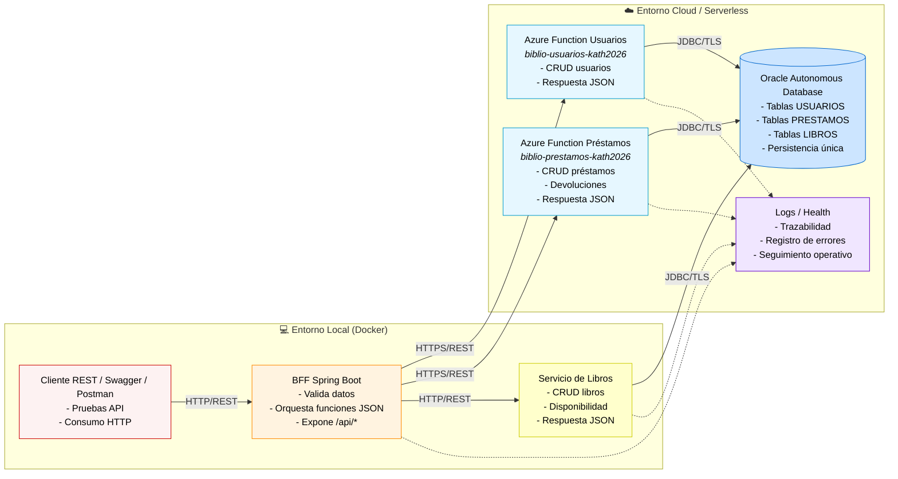

# Diagrama de arquitectura

La arquitectura actual del proyecto es híbrida:

- El cliente consume únicamente el BFF local.
- El BFF expone la API REST, valida entradas y orquesta funciones en Azure.
- Usuarios y préstamos se resuelven mediante Azure Functions en Java.
- El servicio de libros corre en Docker local y consulta la misma Oracle Autonomous Database.
- Usuarios, préstamos y libros persisten en una única base Oracle en la nube.
- La observabilidad se apoya en logs y endpoints básicos de salud.
