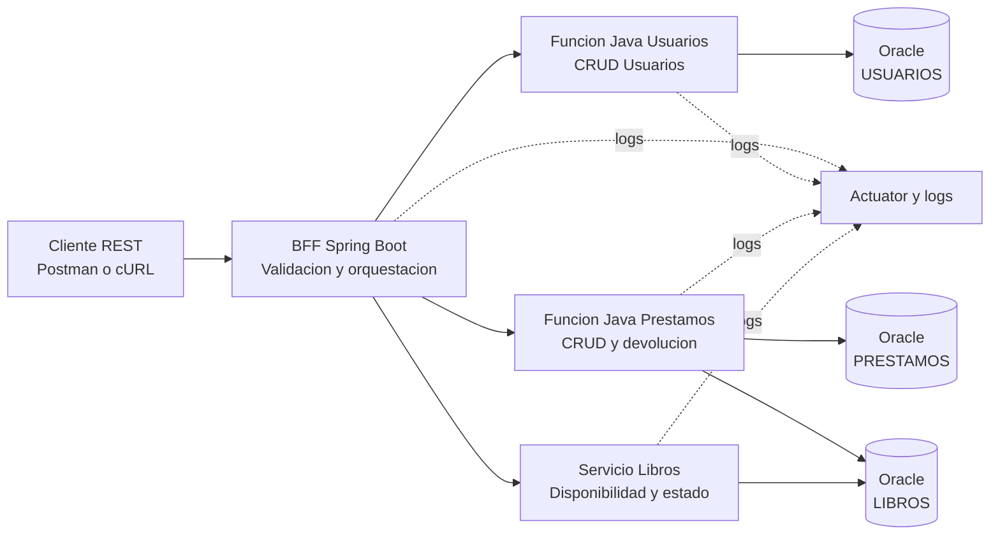

# Diagrama de arquitectura

El flujo implementado respeta el diagrama academico solicitado:

- El cliente solo consume el BFF.
- El BFF expone la API REST y valida entradas.
- Usuarios y prestamos se resuelven mediante funciones Java compatibles con Azure Functions.
- Libros se maneja con un servicio dedicado.
- Oracle persiste usuarios, libros y prestamos.
- El monitoreo se limita a logs y endpoints basicos de salud/metricas.
