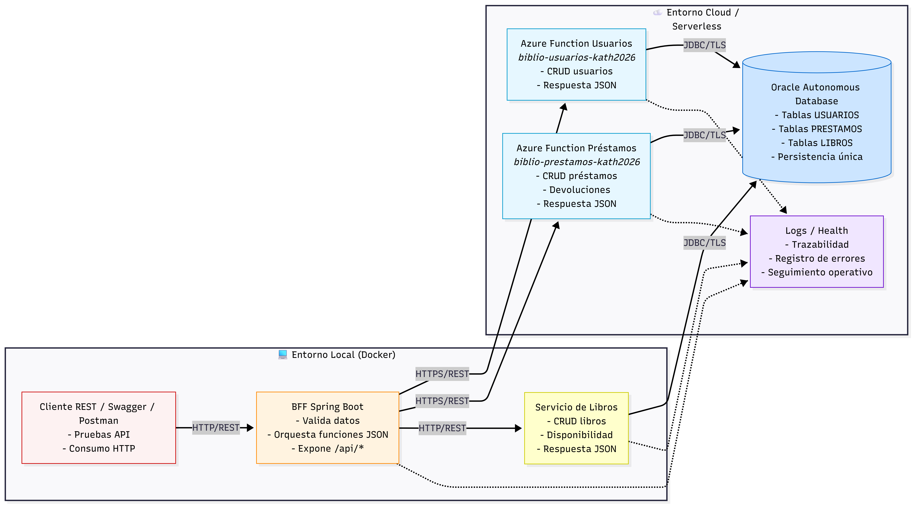
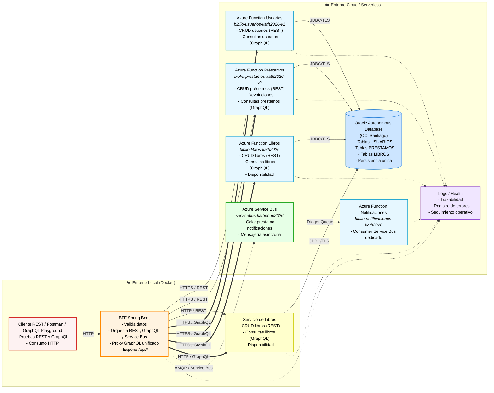

# Diagrama de arquitectura

```mermaid
flowchart LR
    %% === ENTORNO LOCAL (DOCKER) ===
    subgraph Local["💻 Entorno Local (Docker)"]
        Cliente["Cliente REST / Postman / GraphQL Playground<br/>- Pruebas REST y GraphQL<br/>- Consumo HTTP"]
        BFF["BFF Spring Boot<br/>- Valida datos<br/>- Orquesta REST, GraphQL y Service Bus<br/>- Proxy GraphQL unificado<br/>- Expone /api/*"]
        LibrosSvc["Servicio de Libros<br/>- CRUD libros (REST)<br/>- Consultas libros (GraphQL)<br/>- Disponibilidad"]
    end

    %% === ENTORNO CLOUD / SERVERLESS ===
    subgraph Cloud["☁️ Entorno Cloud / Serverless"]
        Usuarios["Azure Function Usuarios<br/><i>biblio-usuarios-kath2026-v2</i><br/>- CRUD usuarios (REST)<br/>- Consultas usuarios (GraphQL)"]
        Prestamos["Azure Function Préstamos<br/><i>biblio-prestamos-kath2026-v2</i><br/>- CRUD préstamos (REST)<br/>- Devoluciones<br/>- Consultas préstamos (GraphQL)"]
        FnLibros["Azure Function Libros<br/><i>biblio-libros-kath2026</i><br/>- CRUD libros (REST)<br/>- Consultas libros (GraphQL)<br/>- Disponibilidad"]
        Notificaciones["Azure Function Notificaciones<br/><i>biblio-notificaciones-kath2026</i><br/>- Consumer Service Bus dedicado"]
        ServiceBus["Azure Service Bus<br/><i>servicebus-katherine2026</i><br/>- Cola: prestamo-notificaciones<br/>- Mensajería asíncrona"]
        OracleDB[("Oracle Autonomous Database<br/>(OCI Santiago)<br/>- Tablas USUARIOS<br/>- Tablas PRESTAMOS<br/>- Tablas LIBROS<br/>- Persistencia única")]
        Logs["Logs / Health<br/>- Trazabilidad<br/>- Registro de errores<br/>- Seguimiento operativo"]
    end

    %% === FLUJOS REST (línea continua) ===
    Cliente -->|"HTTP"| BFF
    BFF -->|"HTTPS / REST"| Usuarios
    BFF -->|"HTTPS / REST"| Prestamos
    BFF -->|"HTTP / REST"| LibrosSvc

    %% === FLUJOS GRAPHQL (línea gruesa discontinua) ===
    BFF ==>|"HTTPS / GraphQL"| Usuarios
    BFF ==>|"HTTPS / GraphQL"| Prestamos
    BFF ==>|"HTTPS / GraphQL"| FnLibros
    BFF ==>|"HTTP / GraphQL"| LibrosSvc

    %% === FLUJO SERVICE BUS (línea punteada) — EDA ===
    BFF -.->|"AMQP / Service Bus"| ServiceBus
    ServiceBus -.->|"Trigger Queue"| Notificaciones

    %% === PERSISTENCIA ===
    Usuarios -->|"JDBC/TLS"| OracleDB
    Prestamos -->|"JDBC/TLS"| OracleDB
    FnLibros -->|"JDBC/TLS"| OracleDB
    LibrosSvc -->|"JDBC/TLS"| OracleDB

    %% === OBSERVABILIDAD ===
    BFF -.-> Logs
    Usuarios -.-> Logs
    Prestamos -.-> Logs
    FnLibros -.-> Logs
    LibrosSvc -.-> Logs
    Notificaciones -.-> Logs

    %% === ESTILOS ===
    style Cliente fill:#fdf2f2,stroke:#cc0000,stroke-width:1px,color:#000
    style BFF fill:#fff3e0,stroke:#ff8800,stroke-width:2px,color:#000
    style LibrosSvc fill:#ffffcc,stroke:#cccc00,stroke-width:1px,color:#000
    style Usuarios fill:#e6f7ff,stroke:#0099cc,stroke-width:1px,color:#000
    style Prestamos fill:#e6f7ff,stroke:#0099cc,stroke-width:1px,color:#000
    style FnLibros fill:#e6f7ff,stroke:#0099cc,stroke-width:1px,color:#000
    style Notificaciones fill:#e6f7ff,stroke:#0099cc,stroke-width:1px,color:#000
    style ServiceBus fill:#e6ffe6,stroke:#009900,stroke-width:1px,color:#000
    style OracleDB fill:#cce5ff,stroke:#0066cc,stroke-width:1px,color:#000
    style Logs fill:#f0e6ff,stroke:#6600cc,stroke-width:1px,color:#000
```

## Leyenda de flechas

| Estilo | Protocolo | Ejemplo |
|--------|-----------|---------|
| `──▶` continua | REST (HTTP/HTTPS) | BFF → Usuarios, Préstamos, Libros |
| `══▶` gruesa | GraphQL (HTTP/HTTPS) | BFF → Usuarios, Préstamos, Function Libros, Servicio Libros |
| `- - ▶` punteada | Service Bus (AMQP) | BFF → Service Bus → Notificaciones |

## Descripción

La arquitectura del proyecto es híbrida y soporta tres protocolos de comunicación:

- **REST**: El BFF proxea operaciones CRUD de usuarios, préstamos y libros mediante HTTP/HTTPS estándar hacia las Azure Functions y el servicio de libros local.
- **GraphQL**: El BFF expone un proxy GraphQL unificado bajo `/api/graphql/{servicio}` que reenvía consultas a las Azure Functions de usuarios, préstamos y libros, y al servicio de libros local.
- **Service Bus (EDA)**: Las notificaciones de préstamos se envían de forma asíncrona a través de Azure Service Bus. La función dedicada de notificaciones (`function-notificaciones`) consume los mensajes de la cola.
- Usuarios, préstamos y libros se resuelven mediante cuatro Azure Functions en Java (usuarios, préstamos, libros, notificaciones).
- El servicio de libros corre en Docker local y consulta la misma Oracle Autonomous Database.
- Todos los servicios persisten en una única base Oracle Autonomous Database en la nube (OCI Santiago) mediante JDBC con wallet mTLS.
- La observabilidad se apoya en logs de trazabilidad y endpoints de salud (actuator).
